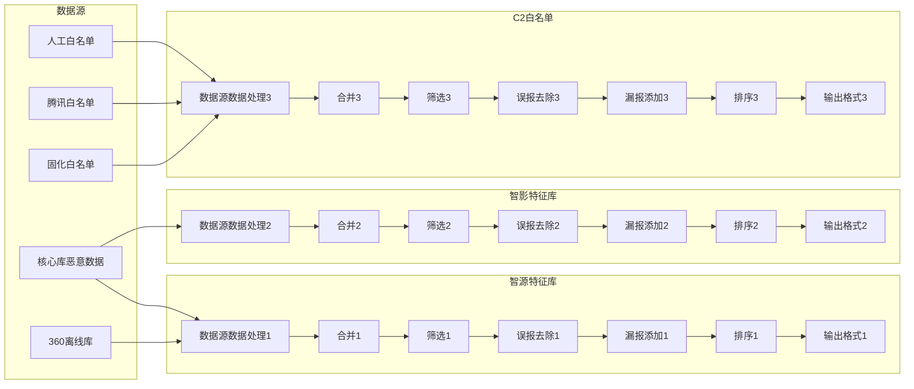
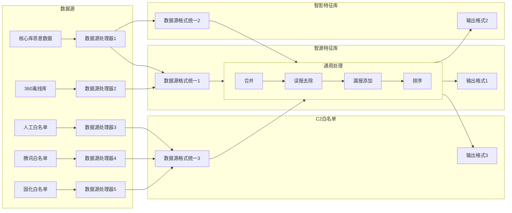
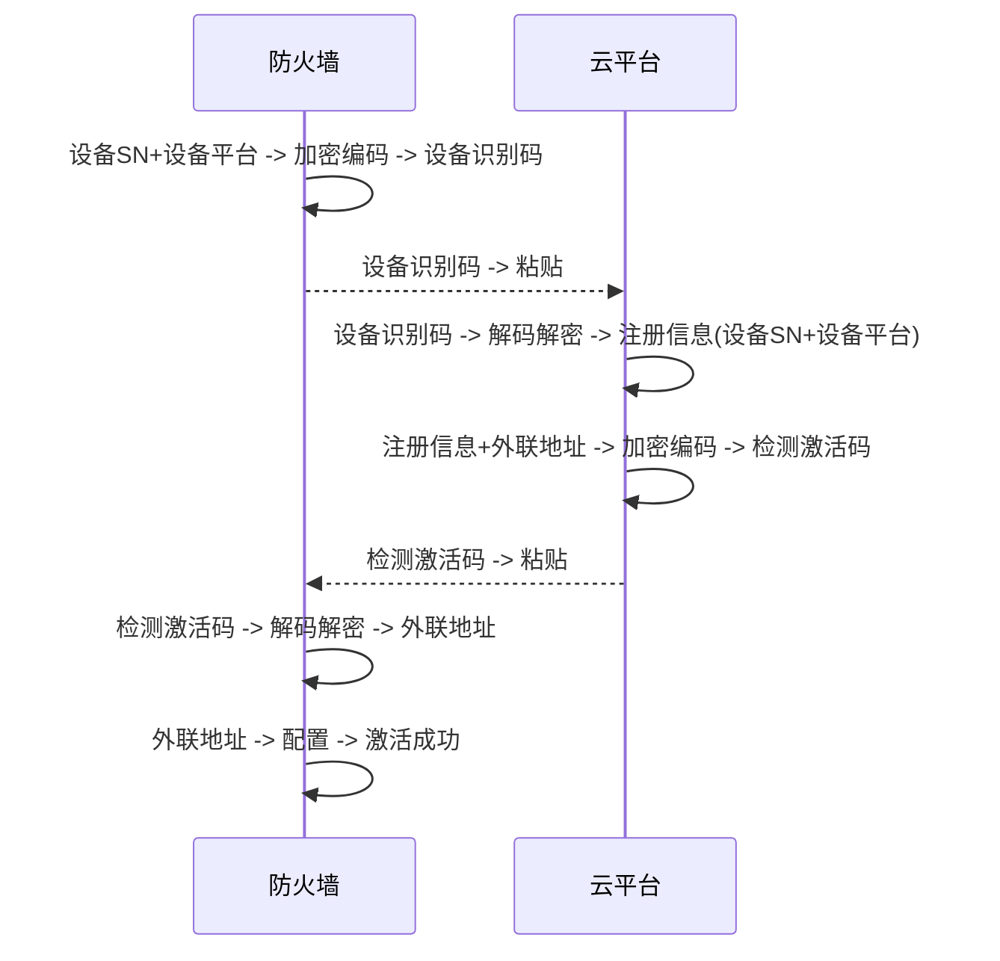
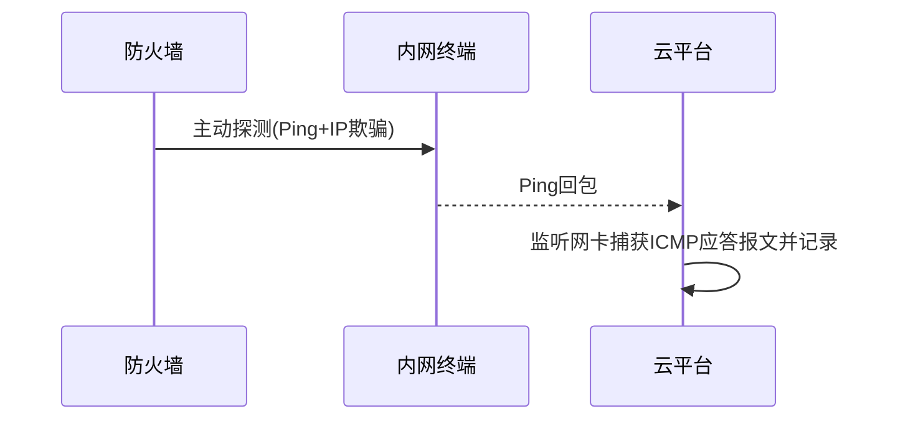
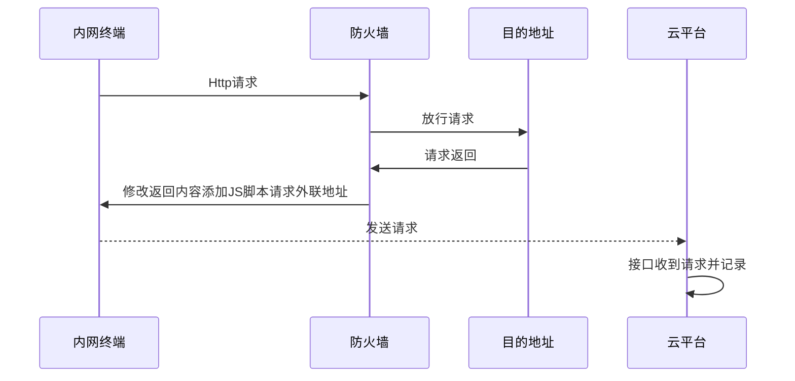

---
# You can also start simply with 'default'
theme: seriph
colorSchema: light
# random image from a curated Unsplash collection by Anthony
# like them? see https://unsplash.com/collections/94734566/slidev
# background: https://cover.sli.dev
background: https://cdn.jsdelivr.net/gh/slidevjs/slidev-covers@main/static/tZr3_JuURZA.webp
# some information about your slides (markdown enabled)
title: 个人述职报告2024
info: |
  个人述职报告2024
# apply unocss classes to the current slide
class: text-center
# https://sli.dev/features/drawing
drawings:
  persist: false
# slide transition: https://sli.dev/guide/animations.html#slide-transitions
transition: slide-left
# enable MDC Syntax: https://sli.dev/features/mdc
mdc: true
fonts:
  sans: LXGW WenKai Mono
  serif: LXGW WenKai Mono
  mono: Fira Code, LXGW WenKai Mono
  local: LXGW WenKai Mono
---

# 个人述职报告2024

<br>
汇报人：吴俊贤
汇报日期：2025/01/07

---
transition: fade
---

# 个人简介

一些简单的个人信息

## 吴俊贤

|      |                  |
|------|------------------|
| 教育程度 | 2021年本科毕业于南京工业大学 |
| 工作经历 | 山石2021年7月至今      |
| 所在部门 | 研发一部/云服务与安全运营部   |
| 直接上级 | 张志华              |

<style>
h1 {
  background-color: #2B90B6;
  background-image: linear-gradient(45deg, #4EC5D4 10%, #146b8c 20%);
  background-size: 100%;
  -webkit-background-clip: text;
  -moz-background-clip: text;
  -webkit-text-fill-color: transparent;
  -moz-text-fill-color: transparent;
}
</style>

<!--
Here is another comment.
-->

---
transition: fade-out
layout: image-right
image: https://cdn.jsdelivr.net/gh/slidevjs/slidev-covers@main/static/SHE_ZiroE0g.webp
---

# 目录

Table of contents

<Toc text-sm minDepth="1" maxDepth="2" />

---
transition: slide-up
layout: center
---

# 工作内容

---
transition: slide-left
level: 2
layout: two-cols
layoutClass: gap-16
---

# FR统计

相关需求实现

## DSGP相关

<br>

- FR41120 敏感特征规则库初始版本
- FR41134 FTP文件系统插件
- ~~FR42168 安全组件管理支持DOG~~
- FR42204 Redis数据源插件
- FR42210 ShenTong数据源插件

::right::

## 云瞻相关

<br>

- <span v-mark.red="1">FR40880 TIP漏洞库中新增CVSS和CWE字段内容</span>
- <span v-mark.red="1">FR41811 【云端】针对iCenter查询请求，需能为其反馈威胁标签和IP应用场景分类信息</span>
- <span v-mark.circle.orange="2">FR42936 同步AV库进入核心库，并实现AV库误报处置后的出库管理机制</span>
- <span v-mark.circle.orange="2">FR44029 智源特征库输出内容增加排序和标签筛选</span>
- <span v-mark.circle.orange="2">FR44831 针对AV特征库需要的数据进行收集和初始化</span>
- <span v-mark.box.cyan="3">FR45890 支持防火墙违规外联检测</span>

---
transition: view-transition
level: 2
zoom: 1.2
---

# 特征库框架搭建

<br>

````md magic-move {lines: true}
```markdown {1,3-5|1,7-9|1,11-} 
## 问题与目标

1. 简化生成记录和统计数据
    
    特征库的生成记录和统计数据繁琐，每次添加新的特征库，都需要建表，添加接口，添加页面

2. 数据源与特征库尽可能解耦

    同一数据源被多个特征库所依赖，当数据源的内容格式发生变化，需要修改全部依赖于它的特征库处理代码
    
3. 特征库统一管理

    配置较为分散，格式不一
```

```markdown {1|3-}
### 简化生成记录和统计数据

1. 使用切面统一拦截写入，新增特征库无需感知记录

2. 按指定格式输出统计数据，统一分维度进行计算

3. 统一特征库、数据源生成记录和统计数据的相关接口及页面
```

```markdown {1|3-}
### 数据源与特征库尽可能解耦

1. 一个数据源的数据只对应一套处理逻辑，相当于预处理，特征库只能使用预处理后的数据

2. 不同特征库对同一数据源的预处理需求不同，依赖于动态表单的配置，可在同一套代码中进行扩展
```

```markdown {1|3-}
### 特征库统一管理

1. 将特征库和数据源的处理逻辑切分成任意数量的处理器，所有的处理器页面统一配置

2. 所有特征库与其下数据源的配置采用统一的格式
    
      特征库配置(基础配置 + 所有的处理器配置(包含执行顺序))
    + 其下的各个数据源配置(基础配置 + 所有的处理器配置(包含执行顺序))
    = 该特征库制作所需全部配置
```
````

---
transition: slide-left
level: 3
zoom: 1
---

# 原先的特征库



---
transition: slide-up
level: 3
zoom: 1
---

# 优化后



---
transition: view-transition
level: 2
zoom: 1
---

# 违规外联平台

云端违规外联检测，Cloud Violation Outreach Detection

在视频专网、医疗物联网场景下，为防范 iot 终端（如存在双网卡的终端）被黑客控制或非法传输数据到互联网，一般禁止网关设备、内网终端设备（iot
设备）在未经授权时访问到互联网。

主要针对终端违规外联（访问恶意域名/ip或翻墙上网，流量经过防火墙）这一情况，部署云端服务实现检测功能。

<v-click>

功能实现

- vod-capture 部署于单独节点，联网且拥有公网 IP，用于接收主动和被动探测发送的数据；
    - 捕获终端被 IP 欺骗后发送来的 ICMP 的回包
    - Http 接口接收防火墙让终端设备发送过来的请求
- vod-gateway 与云景部署于同一 K8s 集群下，拥有前端页面，需登录，提供设备注册和违法外联记录的导出等功能。

</v-click>

---
transition: fade-out
layout: two-cols
level: 3
zoom: 1
---

# 违规外联平台

## 设备注册



::right::

## 违规外联检测



<br>



---
transition: slide-right
level: 2
layout: two-cols
layoutClass: gap-16
---

# 预研任务

<br>

## BUG

<br>

* 【BUG】TIP切换定时任务及分布式锁
* 【BUG】Tip-schema获取方式梳理
* 【BUG】特征库数据数量问题定位
* 【BUG】特征库相关问题
* 其他线上问题修复......

::right::

<br>
<br>

## 预研

<br>

* 【预研】ArangoDB 升级
* 【预研】ArangoDB 对比 NebulaGraph
* 【预研】DNS数据
* 【预研】Redis命令超时分析
* 【预研】云查请求带宽分析
* 【预研】清理云瞻过期用户
* 【预研】特征库框架搭建
* 【预研】特征库误漏报处理方案
* 【预研】设备请求云瞻权限控制

---
transition: fade
zoom: 1
level: 2
---

# 数据库部署相关

关于服务容器化的部署方式

功能更强也会更复杂
<span v-mark.red="1">Docker</span> --> <span v-mark.circle.orange="2">
Docker-Compose</span> --> <span v-mark.box.cyan="3">Docker Swarm + Stack</span> --> <span v-mark.highlight.yellow="4">
K8S Operator</span>

<v-clicks>

- Docker

  使用单一容器运行分布式数据库的每个实例，配置简单，部署启动速度很快，适合单节点，不方便扩展。

- Docker-Compose

  Docker 的进阶，YAML 文件保存配置，方便分享复用，部署启动速度也很快，尤其适合单节点同时部署多个服务的时候，无法自动扩容和负载均衡。

- Docker Swarm + Stack

  Docker Swarm 是 Docker 的原生容器编排工具，支持服务的多节点集群管理。
  Docker Stack 使用 docker-compose.yml 文件来定义 Swarm 集群中的服务。
  实际使用过程中服务启动的速度较慢。

- K8S Operator

  自动化运维、弹性扩展、适合大规模场景，同时也最为复杂。

</v-clicks>

---
transition: view-transition
level: 2
layout: two-cols
layoutClass: gap-16
---

# 脚本工具

## arthas

将使用Arthas热更新代码的过程封装成脚本，方便本地调试也方便线上执行

## dpol

[自动上线脚本编写](https://www.tapd.cn/53345802/markdown_wikis/show/#1153345802001002395)

将上述自动上线脚本准备的过程脚本化，通过选项目前已同时支持tip、ng-cloudview和cps

::right::

<br>
<br>

## dpsv

97环境部署服务快捷命令

```bash
[root@node1 jxwu]# dpsv -h
使用方法：
  [-h] 显示帮助信息
  [-r] 卸载重装pv 默认不重装回收原来的pv
  [-s] 保留探针 默认删除
  [-n namespace] 指定命名空间 目前只在删除pvc时用到
  [-p count] 指定副本数 默认 1
  [-d node] 指定节点
  folder1/zip1 ... folder2/zip2 目录或压缩文件[相对]路径
```

---
transition: view-transition
zoom: 1.2
---

# 自我总结

- 编程

  边写边学习，比较喜欢lambda表达式和函数式接口

  目标：Stream -> CompletableFuture -> Flux/Mono

- 工作的条理性不够清晰，要分清轻重缓急。

  在开发时间很仓促的情况下，事情多了，就得要有详细而主次分明的计划，在这方面还要继续优化。

---
transition: fade
zoom: 1
---

# 未来规划

- 漏洞库相关

  觉得漏洞库的场景更加适合图数据库，如果有新的需求，可以顺便切换。

- 特征库框架

  还有很多可以优化的地方，对于同一数据源数据的复用、大数据量文件的处理（脚本优化、文件切分）等等。

- 云瞻核心数据库 ArangoDB 的升级

  尽可能平稳的切换，避免对业务造成影响。

- 云瞻权限体系

  为设备的请求提供一套尽可能完善的校验流程。

- 云瞻线上服务持续维护

---
layout: center
class: text-center
---

# 感谢大家观看！
